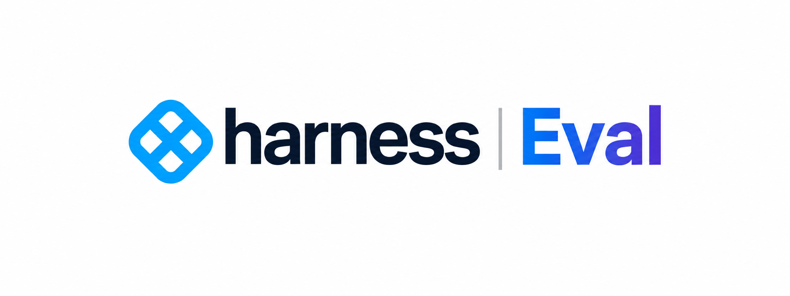
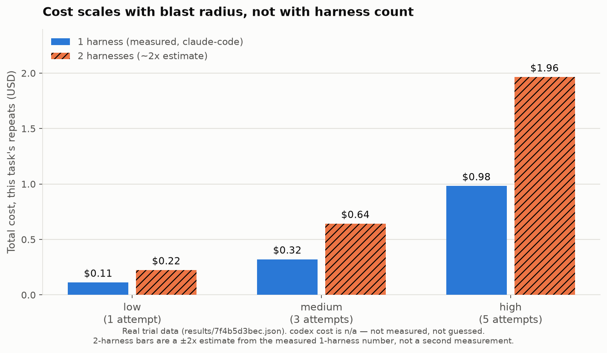
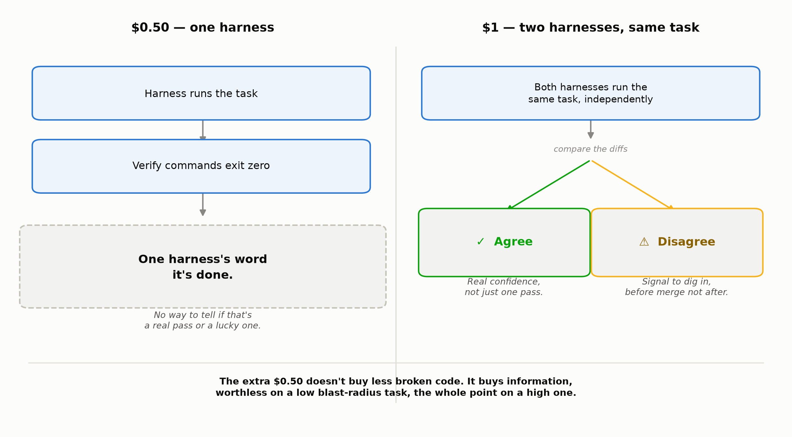
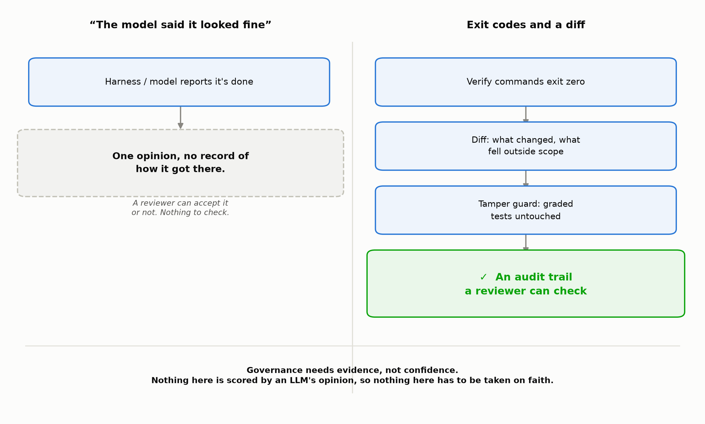

[](https://github.com/barc-ah/harness-eval/actions/workflows/python-app.yml)
[](LICENSE)
[](pyproject.toml)

Run the same task through Claude Code, Codex, Cursor, Aider and OpenCode on
your own repository. Score the results on things a machine can verify. Find
out which runtime actually works on your code instead of on someone else's.

Think of a trial as sending two or more harnesses to war on the same task and
scoring the wreckage. The name is boring on purpose; the point of the tool
is that a battle between harnesses only tells you something once it is
repeated enough times to separate a real win from a lucky one.

**[Wiki](https://github.com/barc-ah/harness-eval/wiki)** ·
**[Install](#install)** ·
**[Architecture](#architecture)** ·
**[Example run](#example-run)** ·
**[Contributing](CONTRIBUTING.md)** ·
**[Writeup](https://medium.com/@barath.ravichander/you-are-benchmarking-the-wrong-thing-df8de2f96a17)**

## See it in action


Real trial, same 3 tasks, blast-radius repeats, not staged output. See
[Example run](#example-run) below for the full table this comes from.

## Why

Published leaderboards change the model and the harness at the same time, then
attribute the whole difference to the model. Independent runs keep finding the
same model landing 15 to 25 points apart depending only on which harness wraps
it. If that gap is real on your repo, you are picking your coding agent on the
wrong variable.

Two things are being compared here, and they are not the same experiment:

- **Agent trials** hold the runtime constant and vary the model or prompt.
- **Harness trials** hold the model constant and vary the whole runtime: file
  editing strategy, context management, subagents, test loop, skill system.

The second one is harder and matters more, because the harness carries
capability the model does not. Config supports both; keep the `model` field
identical across harness blocks and you are running the second experiment.

## Architecture

```
You --> harness-eval CLI --> Runner --> Adapter --> Worktree --> Harness CLI
                                ^                                    |
                                |                                    v
                                +---- repeat (blast radius) ---- Oracle (verify,
                                                                  tamper guard)
                                                                       |
                                                                       v
                                                              Scoring (pass@k,
                                                               Wilson interval)
                                                                       |
                                                                       v
                                                                   Scorecard
```

Every attempt gets a fresh, isolated worktree. The Runner fans a task out across
every enabled harness and repeats it per the task's blast radius (1/3/5 times);
each repeat feeds back into the same Adapter → Worktree → Harness CLI step, not
into some pool of shared state. Nothing here learns or adapts between runs.
Oracle only ever checks exit codes and diffs, never another model's opinion.

## Prerequisites

**Python**: 3.10+

**Harness CLIs** (install separately - not Python packages):

| Harness | Install Command | Adapter status |
|---------|-----------------|-----------------|
| Claude Code | `npm install -g @anthropic-ai/claude-code` | validated against real CLI runs |
| Codex | `npm install -g @openai/codex` | validated against real CLI runs; ChatGPT-account auth needs `model: null` in config |
| OpenCode | `npm install -g opencode-ai` or `brew install opencode` | wired, needs `opencode auth login` before use |
| Cursor | `cursor --install-cli` (or Settings → Install `cursor` command) | wired, not yet run against a real CLI |
| Aider | `pip install aider-chat` | wired, not yet run against a real CLI |

"Validated" means an adapter has actually been run against that harness's real CLI end to end on the fixture repo, not just that the argv looks right on paper. See [Installation](https://github.com/barc-ah/harness-eval/wiki/Installation) in the wiki for the auth quirks found so far.

## Install

```bash
git clone <your-fork> harness-eval && cd harness-eval
pip install -e ".[dev]"
harness-eval doctor
```

`doctor` reports which harness CLIs are on your PATH. Missing ones are skipped
rather than failed, so a partial install still produces a valid scorecard.

## Quick Start

```bash
# 1. Install harness CLIs you want to compare (see Prerequisites above)
# 2. Verify what's available
harness-eval doctor

# 3. Quick test with built-in fixture (3 unsolved tasks)
bash scripts/make_fixture.sh
harness-eval run --tasks tasks/samples --repeats 2

# 4. Mine YOUR repo for real tasks (uses your git history as benchmark)
harness-eval mine --repo ~/code/your-service --since "6 months ago" --out tasks/mined.yaml

# 5. Run on your mined tasks
#    --blast-radius high → more repeats (5), more weight (4x) on high-stakes tasks
harness-eval run --tasks tasks/mined.yaml --blast-radius high
```

## How the benchmark is built

`mine` finds those commits, rolls the source back to the parent, keeps the new
tests, and uses the commit message as the prompt. Tests go green, the harness
rebuilt what your team built. They do not, it did not.

This beats a public benchmark on the only axis that matters to you: the tasks
look like your work, use your libraries, and live in your directory layout.

The obvious limit is that mined tasks are only as good as the prompt you can
recover from a commit message. Repos with terse history yield thin tasks. The
miner scores candidates and drops the ones with nothing to say, which is why
`mine` on a busy repo often returns far fewer tasks than commits.

## Scoring

No model judges another model's code. LLM judges drift, reward plausible
looking output, and will pass a change that quietly deletes the failing test.
Everything scored here is an exit code or a number counted off the diff:

| Signal | Why it is there |
|---|---|
| verify commands pass | the only definition of resolved |
| lines added and removed | a passing 400 line diff is not the same win as a passing 12 line one |
| files touched, files outside hint | scope creep is a real failure mode |
| wall clock, p90 | latency is the actual cost of running two harnesses |
| tokens and cost per resolved | separates a cheap win from an expensive one |
| test tampering | editing the graded tests is an automatic fail |

### Repeats are not optional

Agents are stochastic. Same prompt, same model, different code on Tuesday. A
single run per task measures noise, so every task runs several times and
results are reported as pass@k with a Wilson interval. The `Flaky` column
counts tasks a harness solved on some attempts and not others, which is
usually more actionable than the headline rate.

### Blast radius drives everything

Blast radius is how much breaks if the change is wrong, and how hard it is to
undo. It sets both the repeat count and the weight in the final score.

| | Repeats | Weight | Examples |
|---|---|---|---|
| low | 1 | 1x | one file, tests catch it, reverts in a commit |
| medium | 3 | 2x | a few modules, some shared code |
| high | 5 | 4x | schema migrations, auth, protobufs, terraform, anything other teams consume |

This is also the answer to "is running several harnesses worth it". Running
two harnesses roughly doubles tokens, which is cheap next to engineering time.
The real cost is latency and the overhead of reconciling two answers. Neither
is worth paying on work that reverts in one commit. Both are worth paying on a
migration, where the harnesses disagreeing is exactly the signal you want
before merge.

A harness that aces trivial edits and fails every migration should not top
your scorecard. The weighting is what stops it.

### Costing

Fair question: "won't running two harnesses just double my bill?" It
deserves a real number instead of a hand-wave. In the [example
run](#example-run) above, claude-code resolved every sample task at **$0.16
per resolved task**. Add codex as a second harness on the same task and
token spend roughly doubles, call it ~$0.32 combined, more on a real repo's
harder tasks. Codex's own cost shows as `n/a` in that table because this
tool never guesses a number it didn't measure, so treat "roughly double" as
the honest floor, not a precise total.

Broken out by blast radius, using claude-code's real per-task cost from that
same trial:

| Blast radius | Attempts (this task) | 1 harness, measured | 2 harnesses, ~2x estimate |
|---|---|---|---|
| low | 1 | $0.11 | $0.22 |
| medium | 3 | $0.32 | $0.64 |
| high | 5 | $0.98 | $1.96 |



The doubling is real, but it's doubling cents. What actually scales up is the
repeat count driven by blast radius: going from `low` to `high` is roughly
9x the cost of one harness before you've even added a second one.

That table only shows what you spend to run it. It doesn't show what the
extra spend gets you: spend $0.50 and you get one harness's word that it's
done. Spend $1 and a second harness runs the same task independently, and
you get to compare instead of trust.



Treat it as a premium, not an invoice: a few extra cents and a few extra
minutes of latency, paid only on `high` blast-radius tasks, in exchange for
catching a wrong schema migration, a broken auth change, or a protobuf
contract mismatch *before* it merges instead of after it pages someone. This
tool cannot put a number on that payout, it never guesses a cost it didn't
measure, and "what an incident costs your team" isn't something a task
runner can observe. But the asymmetry is the point: the premium is capped
and known (~2x a task that already costs cents), the payout is whatever
your team's own numbers say a bad `high` blast-radius merge costs in
rollback time, downstream breakage, and trust. For low blast-radius work
that reverts in a commit, that asymmetry doesn't exist and the second
harness isn't worth its own latency, which is exactly why the tool never
spends it there.

### "Why not just run 2-3 models in one harness instead?"

Because that only tells you which model, and it quietly assumes the harness
is a neutral measuring instrument. It isn't. [Endor Labs measured GPT-5.5 at
61.5% functionality inside Codex's own harness and 87.2% running inside
Cursor](https://www.endorlabs.com/research/ai-code-security-benchmark), same
model, same week. If you only ever swap models inside one fixed harness, that
25 point swing is invisible, and you'll credit or blame the model for what is
actually the runtime underneath it.

These are two different experiments and this tool supports both, but only one
tells you about the harness:

- **Agent trial**: harness fixed, model varies. Measures reasoning.
- **Harness trial**: model fixed, harness varies. Measures the runtime: file
  editing strategy, context management, subagents, test loop, skill system.

Picking a model by running it in one harness answers "which model wins
inside this harness," not "which model is best" and not "is this harness
capping every model's score the same amount." Keep the `model` field
identical across harness blocks in `config/harnesses.yaml` and you're running
the harness trial; keep the harness fixed and swap `model` for the agent
trial. Neither substitutes for the other.

### Governance

The output of a `high` blast-radius trial isn't just a score, it's evidence.
Two harnesses agreeing on a schema migration is a real confidence signal,
the kind no amount of re-running one harness can manufacture. Two harnesses
disagreeing is exactly the thing a reviewer wants to see *before* merge, not
after. It's a concrete diff-vs-diff disagreement instead of one harness's
self-report that it's done.

That evidence only holds up if nothing upstream of it is opinion.



A run resolves on exit codes or it doesn't, no model grades another model's
code. A missing measurement stays `None` instead of quietly defaulting to
zero, so a report never claims certainty it doesn't have. A harness that
tries to pass by editing the test it's graded on gets caught and failed
outright, regardless of what the exit code says afterward.

A compliance or security reviewer can audit "verify commands exit zero" and
"here's the diff." They cannot audit "the model said it looked fine," and on
a high blast-radius change, that is not evidence anyone should be signing
off on.

## Configuration

`config/harnesses.yaml` holds one block per harness. Flags move between
releases, so argv extras live in YAML rather than in Python.

```yaml
harnesses:
  - name: claude-code
    adapter: claude-code
    model: claude-sonnet-4-6

  - name: cursor
    adapter: cursor
    model: claude-sonnet-4-6      # same model, different runtime

  - name: my-internal-tool        # anything not built in
    adapter: shell
    command: "mytool run --model {model} -- {prompt}"
```

Include Aider as a control. If a heavyweight harness cannot beat a thin
scaffold on your tasks, it is not earning its token bill.

## Isolation

Every attempt gets its own git worktree on a throwaway branch, created from
the task's base commit and destroyed afterwards. Without that, one harness's
partial edits become the next harness's starting state and the comparison is
worthless. Use `--keep` to leave failed trees on disk; the diff usually
explains more than the score does.

## Reading a scorecard

Rank by weighted score, not pass@1. Then check three things:

1. **Harness effect.** Spread across harnesses at a fixed model. A large
   number here means your tool choice is doing more work than your model
   choice, and picking on vibes is costing you.
2. **Flakiness.** A harness at 70% with 40% flaky is not the same product as
   one at 70% flat. The first is a coin flip you are paying to re-run.
3. **Scope violations.** Files touched outside the hint. High scores here mean
   the harness solves tasks by rewriting more than it should, which passes CI
   and fails review.

## Example run

Fixture repo (`scripts/make_fixture.sh`), 3 sample tasks, blast-radius default
repeats (1/3/5), 18 total attempts:

| Harness | Model | Weighted | pass@1 | 95% CI | Median s | Cost/resolved | Flaky |
|---|---|---|---|---|---|---|---|
| claude-code | claude-sonnet-4-6 | 100.0% | 100.0% | 70%-100% | 50 | $0.16 | 0% |
| codex | (account default) | 100.0% | 100.0% | 70%-100% | 97 | n/a | 0% |

Codex cost is `n/a`, not `$0.00`. It does not emit structured usage the way
Claude Code does, and this tool never guesses a number it did not measure.

Three sample tasks is a smoke test, not a benchmark. Real signal comes from
`harness-eval mine` against your own repo's history.

## Caveats

Trials measure headless single shot performance. They do not measure how a
harness feels to work with interactively, how well it recovers when you
correct it, or how good its skill system is once your team has invested in it.
Those matter and this tool does not see them.

Numbers also age fast. A scorecard is valid for the harness versions and model
snapshots recorded in its config digest, and nothing else. Re-run it rather
than citing an old one.

## Layout

```
harness_eval/
  adapters/      one per harness, plus a shell escape hatch
  mining/        git history to benchmark tasks
  workspace.py   worktree isolation
  oracle.py      verifiable scoring, no LLM judging
  scoring.py     pass@k, Wilson intervals, weighting
  runner.py      fan out and repeat
  report.py      scorecard
tasks/samples/   calibration tasks for the fixture repo
scripts/         fixture generator
```

## License

Apache 2.0.
